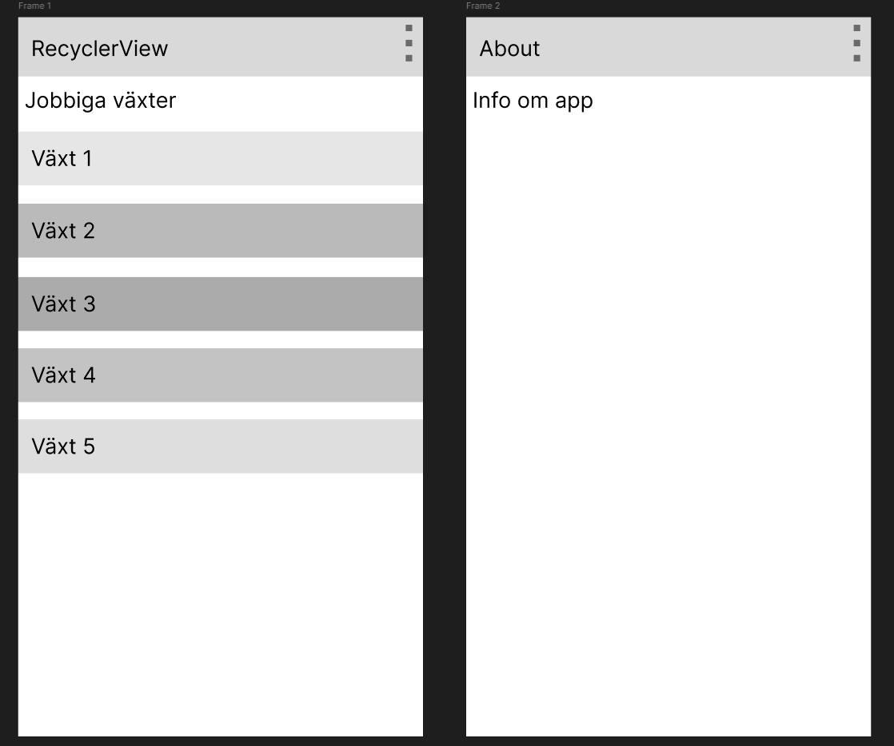
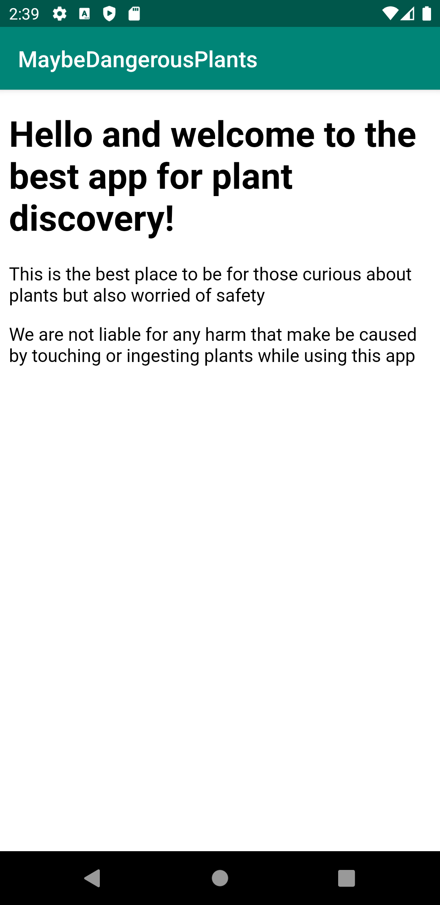
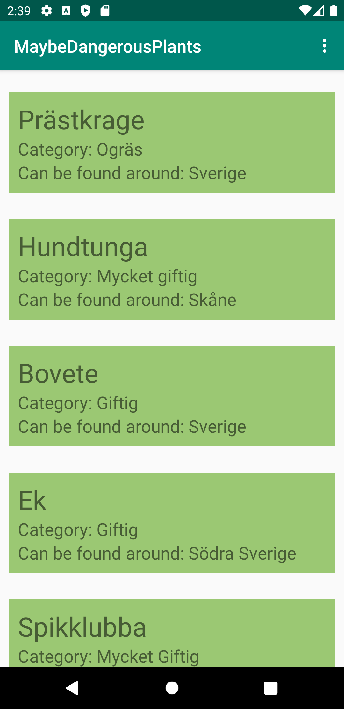
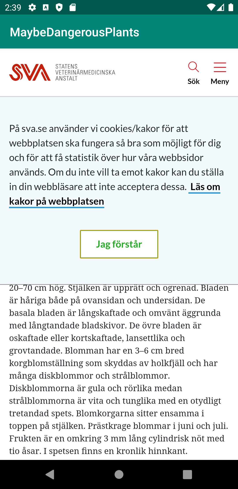

# Rapport

## Skiss
Figma lo-fi design av appens layout:


## Webbtjänst - JSON
JSON-objekten som skapas är exemepel på växter som är olika giftiga, såsom t.ex. prästkrage.
namn - namnet på växten
location - där växten oftast finns, kan variera mellan hela sverige eller en liten ö
category - hur giftig växten är, sidan som jag använde hade: "mycket giftig", "giftig", "oönskad/ogräs"
auxdata - används för att ladda sidan som har all info

```
[{"ID":"Växt_1",
"name":"Prästkrage",
"type":"a23simry",
"company":"",
"location":"Sverige",
"category":"Ogräs",
"size":0,"cost":0,
"auxdata":"https://www.sva.se/amnesomraden/giftiga-vaxter-a-o/prastkrage/"}
```

##Implementationsexempel

Detta är koden som användes för att visa options knapp och about page.
Länk: https://github.com/a23simry/mobileapp-programming-project/commit/0b9da795be4bf821c7d85ec3a5b216afc16f2109

Figur 1 - MainActivity/OptionsMenu
```
  @Override
    public boolean onCreateOptionsMenu(Menu menu) {
        // Inflate the menu; this adds items to the action bar if it is present.
        getMenuInflater().inflate(R.menu.menu_main, menu);
        return true;
    }
    @Override
    public boolean onOptionsItemSelected(MenuItem item) {
        // Handle action bar item clicks here. The action bar will
        // automatically handle clicks on the Home/Up button, so long
        // as you specify a parent activity in AndroidManifest.xml.
        int id = item.getItemId();


        if (id == R.id.about_page) {
            Intent intent = new Intent(MainActivity.this, AboutActivity.class);
            startActivity(intent);
            Log.d("==>","Will display about page");
            return true;
        }

        return super.onOptionsItemSelected(item);
    }
```

Denna koden används för att skapa webview-en som visar sidan för växterna, en url tagen från JSON datan blir skickad samtidigt som activityn startar och 
Länk: https://github.com/a23simry/mobileapp-programming-project/commit/c3578ab6c17fe3a4c09d83396337f61628061359

Figur 2 - WebActivity
```
    @Override
    protected void onCreate(Bundle savedInstanceState) {
        super.onCreate(savedInstanceState);
        setContentView(R.layout.activity_web);

        Intent intent = getIntent();
        String URL = intent.getStringExtra("auxdata");

        WebView myWebView;
        myWebView = findViewById(R.id.web_page);
        myWebView.setWebViewClient(new WebViewClient());
        myWebView.loadUrl(URL);
    }
```
Screenshot från about page

screenshot från main page som visar en recyclerview med items från min JSON data

screenshot på websida för växt som valts, kommer upp cookies som inte går att ta bort :c


## Reflektion
Projektet i sig var lätt då det inte kräver svåra uppgifter, men det blir som vanligt jobbigt när man ska göra saker i android studio.
Det största problemet har varit att hantera android studio och se till att det funkar utan konstiga errors, fick problem och var tvungen att göra om hela projektet för ett error kom upp som inte gick att fixa.
Projektuppgiften har täkt de vi lärt oss ganska bra, känns som man har använt åtminstonde lite av allt.
Saknas lite nyare grejer som t.ex. kotlin istället för java osv. 
Min webview funkar inte jätte bra dels för att cookie-popuppen inte försvinner och jag känner att det inte är ett krav att göra det bättre så jag låter det vara.
